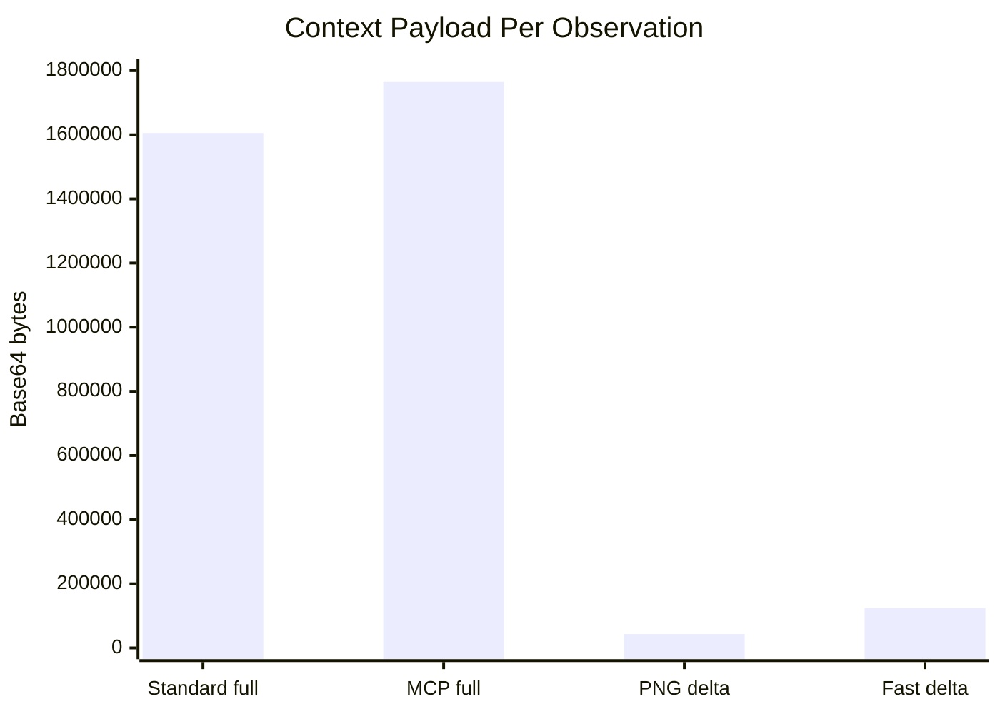
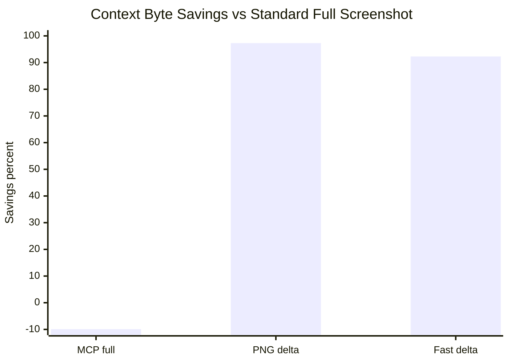
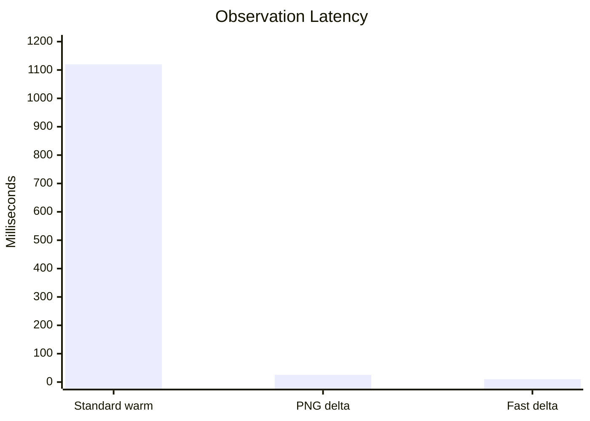
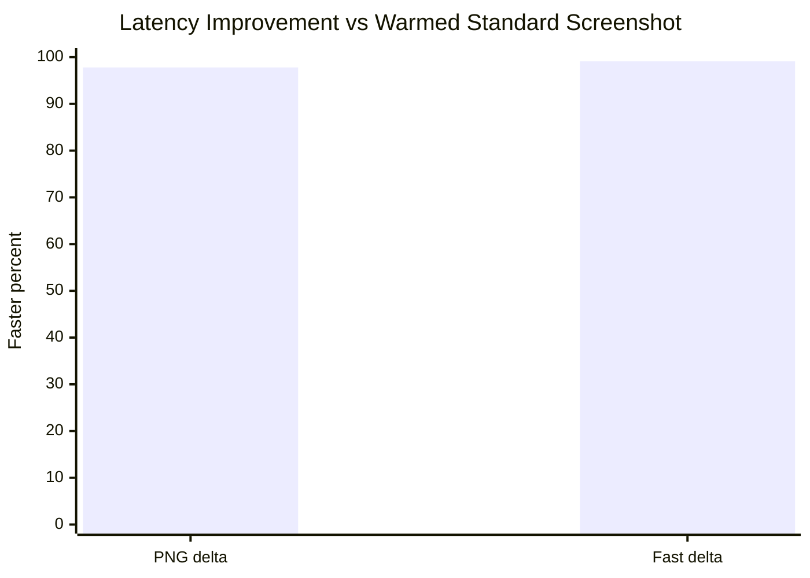

# 2026-07-01 AI MCP Dirty-Region Benchmark

This benchmark compares the current full-screen observation path against the
new `ai-mcp` dirty-region paths on Gadget's live Window Maker desktop.

The benchmark has two focused questions:

1. How many context transport bytes are avoided by sending dirty regions instead
   of full-screen observations?
2. How much latency is avoided by capturing changed regions directly through
   `ai-mcp` instead of using the current screenshot path?

Raw screenshots were not retained. The run recorded byte counts, timings, and
tool output summaries only.

## Environment

| Field | Value |
| --- | --- |
| Host | `gadget` |
| Date | `2026-07-01 America/Phoenix` |
| Display | `:9` |
| Resolution | `1920x1080` |
| Window manager | installed `wmaker-crm` core through `/usr/local/bin/wmaker.real` |
| MCP binary | `/usr/local/bin/ai-mcp` |
| Browser state | live Brave session, maximized |
| Standard capture command | `import -display :9 -window root <png>` |
| MCP smoke command | `python3 scripts/mcp-smoke.py --display :9 --ai-mcp /usr/local/bin/ai-mcp --timeout 60` |

## Size Comparison

`base64_bytes` is the relevant context payload measure for JSON/tool transport.
The baseline is the warmed full-screen screenshot path. The MCP full screenshot
is included to show that the win is not from a different full-frame encoder; the
win comes from avoiding full-frame observations after the initial keyframe.

| Path | Median base64 bytes | Mean base64 bytes | Savings vs standard full screenshot | Payload reduction |
| --- | ---: | ---: | ---: | ---: |
| Standard full screenshot | `1,605,528` | `1,606,240` | baseline | `1.0x` |
| MCP full screenshot | `1,764,754` | `1,764,876` | `-9.9%` | `0.9x` |
| MCP PNG dirty delta | `43,256` | `43,363` | `97.3%` | `37.0x` |
| MCP fast compressed delta | `124,490` | `124,477` | `92.3%` | `12.9x` |

### Size Finding

The best context-byte path is `changed_regions`, which emits PNG crops for dirty
rectangles. In this browser-window test it reduced observation payload from
about `1.61 MB` to about `43 KB`, a `97.3%` reduction. The `changed_regions_fast`
path intentionally trades some payload size for lower latency by returning
compressed raw crop data; even with that tradeoff it still avoided `92.3%` of
the context bytes.

## Latency Comparison

The first ImageMagick sample was a cold-path outlier at `14.46s`, so the primary
comparison uses the warmed standard screenshot samples: `1.00s` and `1.24s`,
with a `1.12s` mean. The table keeps the cold-path data visible because it is
still an operator-visible cost when the screenshot tool has not been warmed.

| Path | Samples | Median latency | Mean latency | Improvement vs warmed standard screenshot |
| --- | ---: | ---: | ---: | ---: |
| Standard full screenshot, all samples | `3` | `1.24s` | `5.57s` | baseline with cold outlier |
| Standard full screenshot, warmed samples | `2` | `1.12s` | `1.12s` | baseline |
| MCP PNG dirty delta | `6` | `25.5ms` | `25ms` | `97.8%` faster / `44.8x` |
| MCP fast compressed delta | `6` | `10ms` | `79ms` | `99.1%` faster by median / `112.0x` |

### Latency Finding

The best latency path is `changed_regions_fast`, with a `10ms` median MCP call
time in this run. One sample spiked to `421ms`; the tool output attributed most
of that to total server-side work (`312ms`) rather than capture (`11ms`) or
encoding (`1ms`). That outlier is why the fast-path mean is `79ms` even though
the median is `10ms`. The next optimization target should be eliminating that
server-side tail latency.

The PNG dirty path is larger-latency than fast deltas because it PNG-encodes the
crop, but it still measured about `25ms`, which is `44.8x` faster than the
warmed full-screen screenshot path and `97.3%` smaller in context bytes.

## Raw Observations

### Standard Full Screenshot

| Sample | PNG bytes | Base64 bytes | Wall time |
| ---: | ---: | ---: | ---: |
| 1 | `1,205,766` | `1,607,688` | `14.46s` |
| 2 | `1,204,128` | `1,605,504` | `1.00s` |
| 3 | `1,204,146` | `1,605,528` | `1.24s` |

### MCP Dirty Regions

| Sample | Full screenshot base64 bytes | PNG delta base64 bytes | PNG delta call | Fast delta base64 bytes | Fast delta call | Fast total | Fast capture | Fast encode |
| ---: | ---: | ---: | ---: | ---: | ---: | ---: | ---: | ---: |
| 1 | `1,765,500` | `43,892` | `26ms` | `124,484` | `10ms` | `6ms` | `4ms` | `0ms` |
| 2 | `1,764,744` | `43,220` | `25ms` | `124,552` | `14ms` | `8ms` | `5ms` | `0ms` |
| 3 | `1,764,788` | `43,316` | `25ms` | `124,496` | `10ms` | `7ms` | `4ms` | `0ms` |
| 4 | `1,764,760` | `43,252` | `26ms` | `124,432` | `10ms` | `6ms` | `4ms` | `0ms` |
| 5 | `1,764,716` | `43,260` | `26ms` | `124,540` | `421ms` | `312ms` | `11ms` | `1ms` |
| 6 | `1,764,748` | `43,240` | `22ms` | `124,360` | `9ms` | `6ms` | `4ms` | `0ms` |

## Recommendation

Use `changed_regions` as the default model-facing observation lane when context
bytes are the limiting resource. Use `changed_regions_fast` for local control
loops where latency matters more than payload size, especially when a second
stage can interpret the compressed crop locally before deciding whether the
model needs pixels.

The next benchmark should run a longer scripted browser workflow and report:

- bytes per completed desktop action;
- latency p50, p95, and max by observation path;
- count of forced keyframes versus true deltas;
- tail-latency attribution for `changed_regions_fast`.
